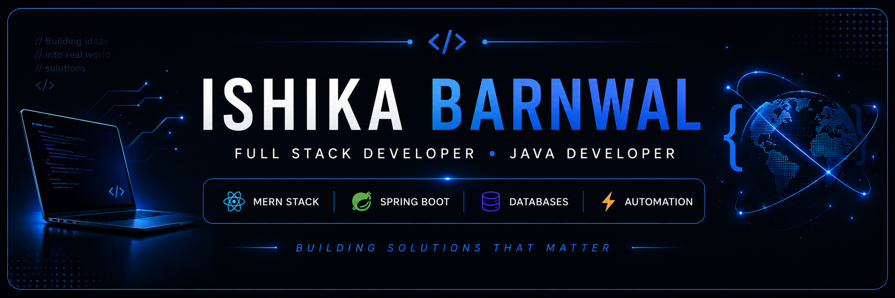

  

<h1 align="center">
Hi 👋, I'm Ishika Barnwal
</h1>

<h3 align="center">
Full Stack Developer • Java Developer • Problem Solver
</h3>

---

# 👩‍💻 About Me

🎓 Final Year B.Tech Computer Science Student

💡 Passionate about building products that solve real-world problems.

🚀 Currently focused on Full Stack Development, Backend Engineering and Data Structures & Algorithms.

🌱 Exploring scalable backend systems, automation and modern web technologies.

---

# 🚀 Featured Projects

| Project | Description |
|---------|-------------|
| 📦 **BorrowBox** | Student rental marketplace for borrowing and renting everyday essentials. |
| 🧭 **Atlas** | Smart campus navigation & accessibility platform. |
| 🔗 **CredChain** | Blockchain powered credential verification platform. |
| 💰 **SettleUp Backend** | Spring Boot backend for expense management. |
| 📚 **LeetCode Solutions** | Collection of accepted Java solutions synced automatically using LeetHub. |

---

# 🛠 Tech Stack

## Languages

## Frontend

## Backend

## Database

## Tools

## Automation

- ⚡ n8n

---

## 🔥 GitHub Streak

  

---

# 🎯 2026 Goals

- 🚀 Build impactful Full Stack Projects
- 📚 Master Spring Boot
- 💻 Solve LeetCode problems
- ☁️ Learn Cloud & System Design
- 🤝 Contribute to Open Source

---

# 🌐 Connect With Me

---

⭐ Thanks for visiting my profile!

